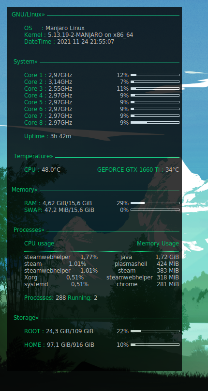

### Документация:

Мой файл конфигурации под Conky

* В `conky_start.sh` изменить "USER" на имя пользователя.
* Положить `conky_start.sh` в `/bin/conky_start.sh`.
* Сделать файл исполняемым - `sudo chmod u+x /bin/conky_start.sh`. 
* Добавить скрипт в автозапуск.